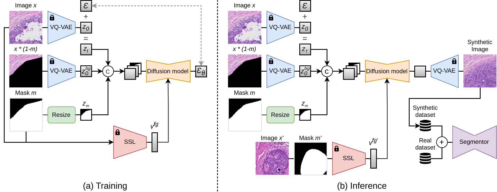

# PathoPainter: Augmenting Histopathology Segmentation via Tumor-aware Inpainting


Official implementation for our **MICCAI 2025** publication [PathoPainter: Augmenting Histopathology
Segmentation via Tumor-aware Inpainting](https://papers.miccai.org/miccai-2025/paper/1254_paper.pdf). This codebase builds on [Large-Image-Diffusion](https://github.com/cvlab-stonybrook/Large-Image-Diffusion).



Tumor segmentation plays a critical role in histopathology,
but it requires costly, fine-grained image-mask pairs annotated by pathologists. Thus, synthesizing histopathology data to expand the dataset is
highly desirable. Previous works suffer from inaccuracies and limited
diversity in image-mask pairs, both of which affect training segmentation, particularly in small-scale datasets and the inherently complex nature of histopathology images. To address this challenge, we propose
PathoPainter, which reformulates image-mask pair generation as a
tumor inpainting task. Specifically, our approach preserves the background while inpainting the tumor region, ensuring precise alignment
between the generated image and its corresponding mask. To enhance
dataset diversity while maintaining biological plausibility, we incorporate a sampling mechanism that conditions tumor inpainting on regional
embeddings from a different image. Additionally, we introduce a filtering
strategy to exclude uncertain synthetic regions, further improving the
quality of the generated data. Our comprehensive evaluation spans multiple datasets featuring diverse tumor types and various training data
scales. As a result, segmentation improved significantly with our synthetic data, surpassing existing segmentation data synthesis approaches,
e.g., 75.69% → 77.69% on CAMELYON16. 

## Requirements
To install python dependencies, 

```
conda env create -f environment.yaml
conda activate pathopainter
```

## Training

First, download the dataset and split the WSIs into patches along with their corresponding masks. We also generate masked images where background regions are removed for inpainting.  

For regional feature extraction, we use [HIPT](https://github.com/mahmoodlab/HIPT) as the self-supervised model to obtain tumor region embeddings.  
The checkpoints can be downloaded from [here](https://drive.google.com/drive/u/0/folders/1vovXjxP6k_2P6LMfSvdYRytlRVZN7yz1).
A training example is provided in [./tool/HIPT](./tool/HIPT/). After training HIPT, extract the tumor region embeddings for the training set and save them locally.  

With the image, masked image, mask, and tumor embeddings prepared, you can train the model by running:

```
bash train.sh
```


## Inference (Sampling)

During inference, we apply K-means clustering to group tumor region embeddings.
For each image, we sample one random embedding from its cluster and feed it together with the image, masked image, and mask.

An example for sampling is provided in:

```
python sampling.py
```

The augmented dataset can then be used to re-train your segmentation model for improved performance.


## Bibtex

```
@misc{liu2025pathopainteraugmentinghistopathologysegmentation,
      title={PathoPainter: Augmenting Histopathology Segmentation via Tumor-aware Inpainting}, 
      author={Hong Liu and Haosen Yang and Evi M. C. Huijben and Mark Schuiveling and Ruisheng Su and Josien P. W. Pluim and Mitko Veta},
      year={2025},
      eprint={2503.04634},
      archivePrefix={arXiv},
      primaryClass={cs.CV},
      url={https://arxiv.org/abs/2503.04634}, 
}
```
